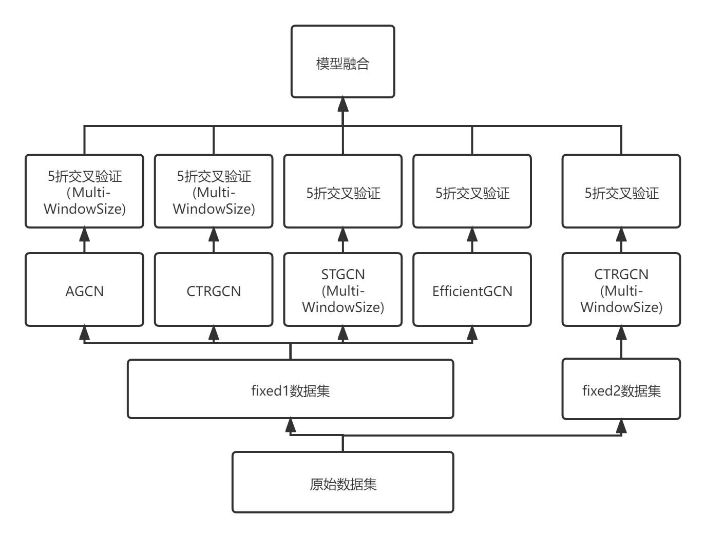

# 2021 CCF BDCI基于飞桨实现花样滑冰选手骨骼点动作识别-第2名方案

## 项目描述
基于PaddleVideo的花样滑冰选手骨骼点动作识别项目

## 项目整体架构


## 环境要求
* paddlevideo>=2.2.0
* numpy
* pandas
* qdm
* PyYAML>=5.1
* opencv-python==4.2.0.32
* decord==0.4.2
* av==8.0.3

运行以下命令安装必要环境
```
pip install -r requirements.txt
```


## 模型训练

### 数据预处理

```
mv data/data118216/* data/
cd work/PaddleVideo
python data_process.py
```
note：请将data_process.py,主函数中base_path修改为您的数据集根目录,初始数据集目录如下所示    
```
|- base_path
     |- train_data.npy
     |- train_label.npy
     |- test_B_data.npy     
```
预处理后目录如下所示
```
|- base_path
    |- fixed1_fold
        |- fold0_train_data.npy
        |- fold0_train_label.npy
        |- fold1_train_data.npy
        |- fold1_train_label.npy
        ...
        |- fold5_train_data.npy
        |- fold5_train_label.npy
    |- fixed2_fold
        |- fold0_train_data.npy
        |- fold0_train_label.npy
        |- fold1_train_data.npy
        |- fold1_train_label.npy
        ...
        |- fold5_train_data.npy
        |- fold5_train_label.npy
    |- fixed1_train_data.npy
    |- fixed2_train_data.npy
    |- fixed1_test_B_data.npy       
    |- fixed2_test_B_data.npy       
    |- train_data.npy
    |- train_label.npy
    |- test_B_data.npy     
```

### 模型训练
```
python main.py --valid 
```
note: 修改数据集根目录后，需要修改configs/recognition中用到的YAML文件的数据集路径。在main.py中定义了要训练的模型，有更改需求请自行修改。

训练后权重会保存在output文件夹中
```
python main.py --test
```
对训练好的模型权重进行测试，生成对应的score.npy

note: 对部分的模型进行了多尺度的测试，在main.py中有详细的定义。在测试时如果显存超出，请改小模型对应batch_size，但可能会影响模型精度。


### 模型后处理
```
python out_score.py
```
note: 在out_score中预定义了融合的参数

执行命令在当前目录生成submission.csv

## 模型复现

模型权重文件在 data/目录下 output_backup.zip

解压并复制里面权重到PaddleVideo/output内，此时运行测试再融合即可复现结果

```
cd /home/aistudio/work/PaddleVideo
unzip -o /home/aistudio/data/output_backup.zip
mv -b output_backup/* output

python main.py --test
python out_score.py
```

（注意：由于B榜提交有一个模型使用有误，将configs/recognition/ctrgcn_fold中的5个 yaml文件首段name:"CTRGCN2"改为name:"CTRGCN"即可复现）